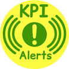
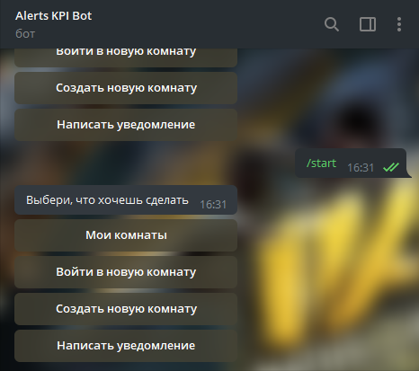
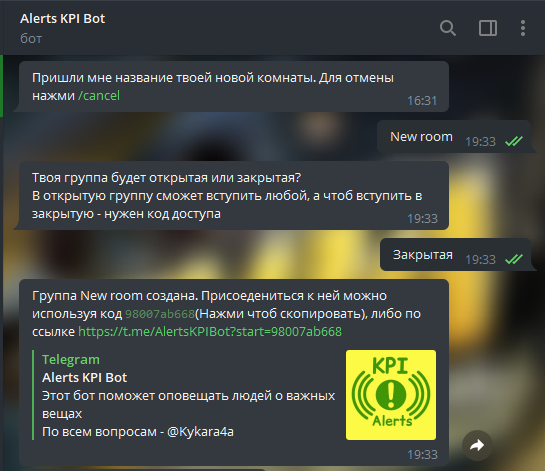
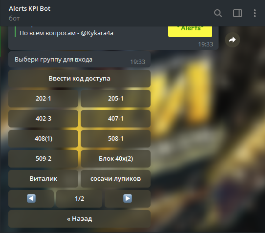
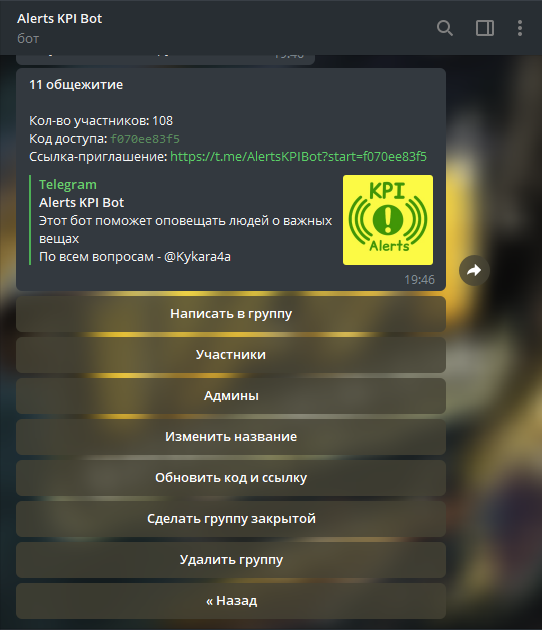
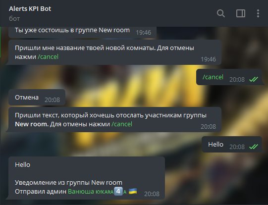

# AlertsKpiBotPublic
 Public repository of AlertsKpiBot project

You can find bot by this [link](https://t.me/AlertsKpiBot) or by tap a picture above

Now we have **1100+ users** and **6000+ screenshots**

## Description

This bot will help notify people about important things. To do this, you can create a group in the bot, 
invite people there and write notifications. For example, you can notify classmates about the beginning 
of a couple or roll call, because not everyone reads chats or channels 

## Usage
### Creating new room
1) Click start button or /start command. You will see user menu:

2) Click "Создать новую комнату" button, then enter name of your room and type (open or close):

You will see code and link of room, share them to other users to join

### Entering existing room

1)If you don`t have invite link: in main menu click "Войти в новую комнату". You will see list of open rooms. 
Click name of your room there or click 
"Ввести код доступа" and then enter code of the room if room that you are looking for is closed:

2) If you have invite link: just follow it and press start at the bottom of the screen

### Managing your rooms

Choose room in "Мои комнаты" in main menu. There you can see list of users or admins, change group name, update link and code, 
change group privacy or delete your group.

### Sending alerts

You can send alert by choosing room in your rooms and then clicking "Написать в группу" or by "Написать уведомление" 
in main menu and then choosing your room:

**Note:** only admins will see who sent the alert, other members will see only alert text. 